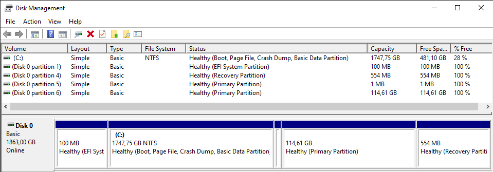
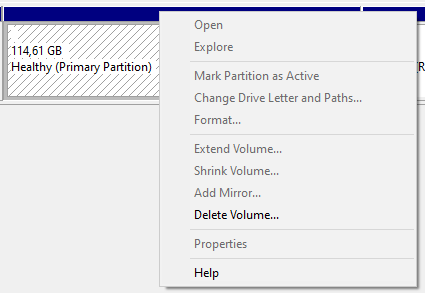
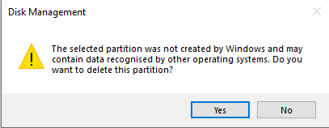
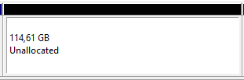
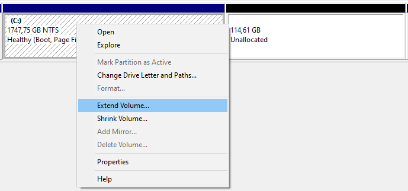
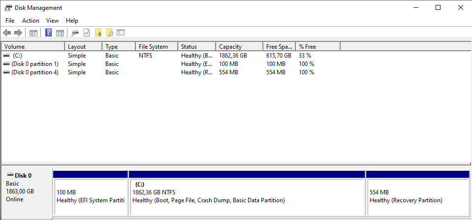

[win-logo]: https://upload.wikimedia.org/wikipedia/commons/5/5f/Windows_logo_-_2012.svg

# Partitions in storage systems

## 0. Description

The software `Disk management` from `Windows` is used to create or remove partions of a storage device. There are different types of partitions:

- Basic Data Partition
- EFI System Partition - Responsable for the bootloader
- Recovery Partition - Mini `Windows` if the normal OS runs into problems

## 1. Usecase

Partitions can be used to have virtual seperations on your storage system. For example the storage gets divided in two parts - on for the operating system `OS` and the other for documents and files. Other `OS` can be installed on the same storage device and will take their own partition.

`Windows 10` automatically creates 3 partions - Basic Data, EFI System and Recovery. Looking into the `Disk management` can remove unnecessary partitions for example from old `Windows` installations or dual-boot systems.

## 2. Tutorial

The following tutorial will explain how to remove partitions on a working `Windows 10` device. While doing a new OS installation, the `Windows`-Setup gives the same options as the `Disk managment` software. Different partions will be shown and can be created or removed.

> ⚠️ Deleting partitions lead to a full remove of all data!

0. Open `disk management` by pressing the  and type into the search "Disk Management".

    

1. The following window should open up:

    

2. Partition 1 and 4 are from the `Windows 10`-OS. Partition 5 and 6 are from another OS. This partition will be removed and added to the `C:` partition. Right clicking on a partition will highlight it by hatching it. Different options are available, the most important are - Format..., Extend Volume... and Delete Volume...

    

    

3. This results in Unallocated partions which can be merged with the main partition.

    

4. Finally, the partition that should be merged with the unallocated partition can than be extended by rightclicking on it.

    

5. Extending the maximum amount of MB possible will lead to the following result:

    

In this case, Disk 0 results in the EFI, Data and Recovery partition that will be present of a data storage with a `Windows` installment. Disks without an OS will be a full data partition if no partitions were made for it.